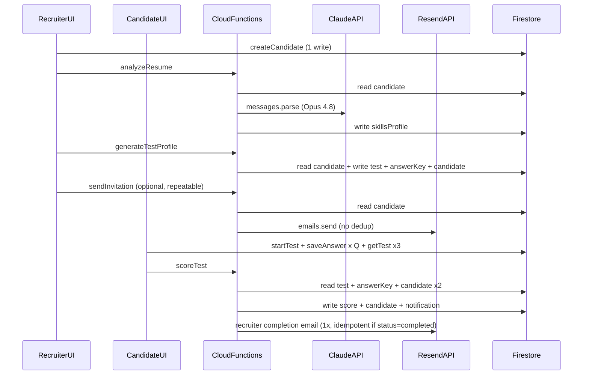

# API Cost Review and Abuse Mitigation Plan

## Current API call map

### Resend ([`functions/src/sendInvitation.ts`](functions/src/sendInvitation.ts), [`functions/src/scoreTest.ts`](functions/src/scoreTest.ts))

| Trigger | Emails | Server guards today |
|---------|--------|---------------------|
| Recruiter clicks "Send email" ([`InviteLinkPanel.tsx`](src/components/recruiter/InviteLinkPanel.tsx)) | 1 to candidate | Auth + ownership only |
| Recruiter clicks "Resend invite" ([`TestHistoryPanel.tsx`](src/components/recruiter/TestHistoryPanel.tsx)) | 1 to candidate | **None server-side**; UI re-enables after 3s |
| Candidate submits test → `scoreTest` | 0–1 to recruiter | Skips if test already `completed` |

**Abuse gap:** A recruiter can call `sendInvitation` unlimited times. Each call = 1 Resend API call + 1 Firestore read. No `invitationSentAt` tracking exists despite being documented in [`TECHNICAL_ARCHITECTURE.md`](src/docs/TECHNICAL_ARCHITECTURE.md).

**UI-only guards (weak):**
- [`InviteLinkPanel`](src/components/recruiter/InviteLinkPanel.tsx): disables button after send until page refresh
- [`TestHistoryPanel`](src/components/recruiter/TestHistoryPanel.tsx): 3-second "Invite sent!" label, then button is clickable again

### Claude ([`functions/src/analyzeResume.ts`](functions/src/analyzeResume.ts))

| Trigger | Skipped? |
|---------|----------|
| New submission ([`NewSubmissionPanel.tsx`](src/components/recruiter/NewSubmissionPanel.tsx)) | No |
| Profile save ([`CandidateDetailPage.tsx`](src/pages/recruiter/CandidateDetailPage.tsx) `handleUpdateProfile`) | **Never** — always re-runs even if only name/email changed |
| Manual retry (`handleRetryAnalysis`) | No |
| Manual skills edit (`updateCandidateSkillsProfile`) | Yes — no Claude call |

**Model:** `claude-opus-4-8`, `max_tokens: 16000`, structured output via Zod. No prompt caching, no token logging, no "already analyzed" short-circuit.

**Not Claude:** `generateTestProfile`, `extractResumeText` (pdf-parse/mammoth), test scoring.

### Firebase (Firestore + Functions)

**Per completed test (typical Q ≈ 40–55 questions):**

| Step | Reads | Writes |
|------|-------|--------|
| Create candidate | 0 | 1 |
| analyzeResume | 1 | 1 |
| generateTestProfile | 1 | 3 |
| Test landing + runner + results (`getTest` ×3) | 3 | 0 |
| `startTest` | 0 | 1 |
| `saveAnswer` per question | 0 | **Q** (dominant cost) |
| `scoreTest` | 4 | 3 |
| **Total** | **~9** | **~9 + Q** |

**Example:** Q=45 → **54 writes**, **9 reads** per full pipeline.

**Storage:** Client never uploads to Firebase Storage; resumes are pasted or sent base64 to `extractResumeText`. Storage cost ≈ **$0** today.

**Real-time listeners** (`onSnapshot` on candidate detail, test history, dashboard) add reads on every doc change — mostly recruiter-side, not billed per external API but adds Firestore read volume.

**Other unguarded repeat actions:**
- `generateTestProfile` creates a **new test token every click** ([`generateTestProfile.ts`](functions/src/generateTestProfile.ts) L65–90) — orphan test docs, extra writes, no Resend/Claude cost
- `scoreTest` reads candidate **twice** in notification helpers (minor waste)

---

## Cost estimates (June 2026 pricing)

Assumptions for a **typical happy path** (1 resume analyzed, 1 test generated, candidate completes test, 1 invite + 1 completion email):

| Component | Assumption | Cost per candidate |
|-----------|------------|-------------------|
| **Claude Opus 4.8** | ~800 token static prompt + ~2,000 token resume in, ~1,000 token JSON out | **~$0.03–0.05** |
| **Resend** | 2 transactional emails | **~$0.002** (Pro: $20/50k ≈ $0.0004/email) |
| **Firestore** | ~54 writes + ~9 reads | **~$0.0001** (negligible vs Claude) |
| **Cloud Functions** | ~5 invocations, ~10 GB-seconds total | **~$0.001** |
| **Total variable** | | **~$0.04–0.06** |

**Claude dominates** (~85–95% of external API spend). Firebase stays within free tier until roughly **10k+ completed tests/month** given current write pattern (540k writes at 10k tests vs 600k/month free allowance).

### Monthly scaling (happy path, no abuse)

| Volume | Claude (~$0.04 ea) | Resend (2 emails/candidate) | Firestore | Est. monthly total |
|--------|-------------------|----------------------------|-----------|-------------------|
| **100** | $4 | Free tier (3k/mo) | Free tier | **~$4–5** |
| **1,000** | $40 | Pro $20 plan covers 2k emails | Free tier | **~$40–45** (+ $20 plan if not already subscribed) |
| **10,000** | $400 | Pro $20 still covers 20k emails | ~540k writes, mostly free | **~$420** |

### Abuse impact examples

| Scenario | Extra cost | Notes |
|----------|-----------|-------|
| Recruiter resends invite **10×** per candidate (1k candidates) | +9,000 Resend emails ≈ **$8** overage or burns quota | No Claude cost; pure Resend + 9k Firestore reads |
| Recruiter saves profile **5×** without resume change | +4 × $0.04 ≈ **$160/mo at 1k candidates** | Claude re-runs every save ([`updateCandidateProfile`](src/services/candidates.ts) clears profile + [`handleUpdateProfile`](src/pages/recruiter/CandidateDetailPage.tsx) always calls `analyzeResume`) |
| Recruiter regenerates test **3×** per candidate | +6 extra Firestore writes/test, orphan docs | No Resend/Claude unless they also resend |

---

## Mitigation plan (recommended phases)

### Phase 1 — Server-side invite throttling (addresses your Resend concern)

**Goal:** Make repeated "Resend invite" clicks cheap to ignore server-side.

**Changes in [`sendInvitation.ts`](functions/src/sendInvitation.ts):**

1. Store send metadata on the **test doc** (not candidate — one invite maps to one test token):
   - `lastInvitationSentAt: Timestamp`
   - `invitationSendCount: number`
2. Before calling Resend, enforce cooldown in a **Firestore transaction**:
   - Default: reject if `lastInvitationSentAt` is within **5 minutes** (return `resource-exhausted` with seconds remaining)
   - Optional hard cap: max **5 sends per test** (configurable)
3. After successful send, update test doc with timestamp + increment count
4. Pass Resend **idempotency key** (e.g. `invite-{testId}-{floor(timestamp/300)}`) so duplicate requests within the same 5-minute window dedupe at Resend's layer too

**Frontend sync ([`InviteLinkPanel.tsx`](src/components/recruiter/InviteLinkPanel.tsx), [`TestHistoryPanel.tsx`](src/components/recruiter/TestHistoryPanel.tsx)):**

- Read `lastInvitationSentAt` from subscribed test doc (already on candidate detail page)
- Disable send button with countdown until cooldown expires
- Show "Last sent {time ago}" and offer **Copy link** / **mailto:** as zero-cost alternatives (already present)

**Why test doc, not candidate:** Resend is tied to a specific `inviteUrl`/token; restarting a test creates a new token and should reset the cooldown independently.

### Phase 2 — Skip unnecessary Claude calls

**Goal:** Stop paying ~$0.04 every time a recruiter fixes a typo in the candidate name.

1. **Resume content hash** on candidate doc: `resumeTextHash` (SHA-256 of normalized text)
2. In `analyzeResume`:
   - If `skillsProfile` exists and hash matches → return cached profile (no API call)
   - If hash unchanged but `analysisError` set → still allow retry (explicit)
3. In [`handleUpdateProfile`](src/pages/recruiter/CandidateDetailPage.tsx):
   - Only call `analyzeResume` when `editResumeText !== candidate.resumeText`
   - For name/email-only edits, use a lighter `updateCandidateProfileMetadata` that does **not** null out `skillsProfile`
4. **Prompt caching** in `analyzeResume`: split static instructions into a cached `system` or prefixed block with `cache_control: { type: "ephemeral" }` — saves ~$0.004/write on the static ~800 tokens after first call (small but free at scale)

**Optional product decision:** Switch to `claude-sonnet-4-6` ($3/$15 per MTok) for resume parsing — likely **~60% cheaper** (~$0.015/analysis) if quality is acceptable. Keep Opus for edge cases or A/B test first.

### Phase 3 — Reduce Firestore write volume

**Goal:** Cut the largest Firebase cost driver (legitimate usage, not abuse).

1. **Batch answer persistence** in [`TestRunnerPage.tsx`](src/pages/candidate/TestRunnerPage.tsx):
   - Keep answers in local state as today
   - Flush to Firestore every **3–5 questions** or on timer expiry, not every `handleAdvance`
   - Final flush on submit
   - Reduces Q=45 from 45 writes to ~9–15
2. **Fix `scoreTest` duplicate reads** — fetch candidate once, pass to notification helpers
3. **Guard `generateTestProfile`** — if current test is `pending`/`in-progress` and not expired, confirm before creating another token (UI confirm + optional server check)

### Phase 4 — Observability and quotas

1. Log Claude `response.usage` to Firestore subcollection or Cloud Logging metric
2. Track `invitationSendCount` / monthly send totals per recruiter (`createdBy`) for billing alerts
3. Resend dashboard alerts (80%/100% quota) — already supported by Resend
4. Consider per-recruiter monthly caps aligned with subscription tier (future billing hook)

---

## Priority recommendation

| Priority | Change | Impact | Effort |
|----------|--------|--------|--------|
| **P0** | Server invite cooldown + Firestore tracking | Stops Resend abuse | Small |
| **P0** | Skip Claude when resume unchanged | Saves largest accidental cost | Small |
| **P1** | UI cooldown from `lastInvitationSentAt` | Better UX + fewer failed calls | Small |
| **P1** | Batch `saveAnswer` writes | ~70% Firestore write reduction | Medium |
| **P2** | Prompt caching / Sonnet evaluation | ~5–60% Claude savings | Medium |
| **P2** | Usage logging | Visibility for billing | Small |

---

## What you do not need to worry about yet

- **Firebase Storage** — unused in the happy path
- **Completion emails** — already idempotent via `status === 'completed'` check in [`scoreTest.ts`](functions/src/scoreTest.ts)
- **Firestore at 10k/month** — likely still near free tier with current read/write counts; Claude is the budget line item

The existing [`TECHNICAL_ARCHITECTURE.md` Cost Analysis](src/docs/TECHNICAL_ARCHITECTURE.md) section is **outdated** (references Google NLP, SendGrid, and underestimates Claude entirely). Update it after implementing Phase 1–2 with the numbers above.
