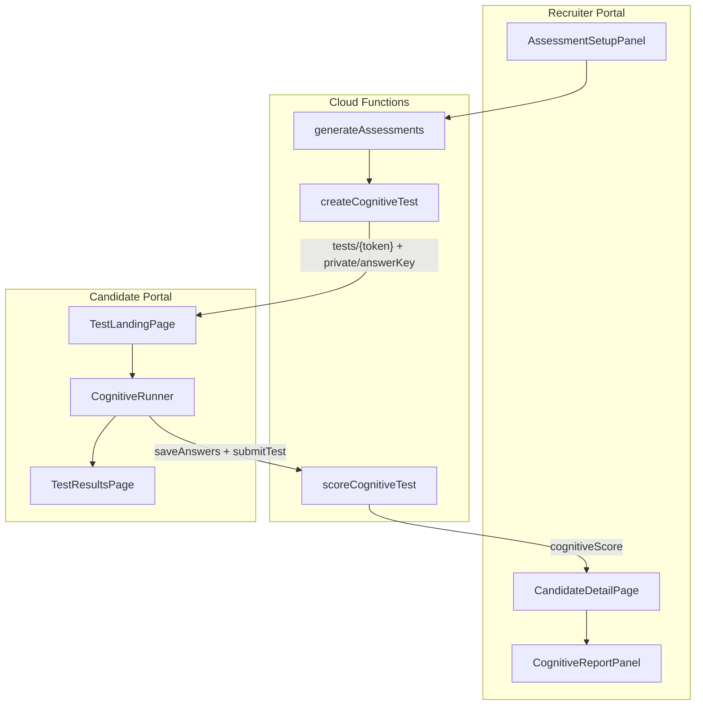

# Cognitive Tests — Implementation Plan

**Document:** COGNITIVE_TESTS  
**Status:** Implementation plan  
**Last updated:** June 2026

Product and engineering plan for cognitive ability assessments in PracticalSkills: research value for recruiters, instrument design, candidate UI (including timers), recruiter results, and phased implementation. Supersedes the high-level backlog in [COGNITIVE_PHASE2.md](./COGNITIVE_PHASE2.md).

Related docs: [PERSONALITY_TESTS.md](./PERSONALITY_TESTS.md), [PROJECT_OVERVIEW.md](./PROJECT_OVERVIEW.md), [RECRUITER_WORKFLOW_1.md](./RECRUITER_WORKFLOW_1.md)

---

## Current state

Cognitive is **typed but stubbed** across the stack:

- [`src/types/assessmentBundle.ts`](../types/assessmentBundle.ts) — `TestType` includes `'cognitive'`; label/description say "coming soon"
- [`functions/src/generateAssessments.ts`](../../functions/src/generateAssessments.ts) — throws `unimplemented` when cognitive is selected (line 53–55)
- [`src/components/recruiter/AssessmentSetupPanel.tsx`](../components/recruiter/AssessmentSetupPanel.tsx) — disabled checkbox with "Coming soon"
- [`src/docs/COGNITIVE_PHASE2.md`](./COGNITIVE_PHASE2.md) — backlog spec (instrument, bank, scoring, UI, compliance)
- **Missing:** question bank, `createCognitiveTest`, `scoreCognitiveTest`, candidate runner, recruiter report panel, `cognitiveScore` on `TestDoc`

The personality test is the **reference architecture** to mirror end-to-end ([`PersonalityRunner`](../components/candidate/personality/PersonalityRunner.tsx), [`scorePersonalityTest`](../../functions/src/scorePersonalityTest.ts), [`PersonalityReportPanel`](../components/recruiter/PersonalityReportPanel.tsx)). The technical test is the **reference for timed per-question UX** ([`TestTimer`](../components/candidate/TestTimer.tsx), [`TechnicalRunner`](../pages/candidate/TestRunnerPage.tsx)).



---

## 1. Research and recruiter value proposition

Surface key points from this section in the recruiter report and [`WhatWeDoPage`](../pages/recruiter/WhatWeDoPage.tsx) cognitive tab.

### What to document for recruiters

| Theme | Research-backed message | How PracticalSkills uses it |
|-------|-------------------------|----------------------------|
| **Predictive validity** | General cognitive ability (g) meta-analyses show ρ ≈ 0.31 for training performance and ρ ≈ 0.23–0.31 for job performance across occupations (Schmidt & Hunter, 1998; updated meta-analyses). Strongest single predictor in I/O literature. | Position cognitive as **complementing** work-sample technical tests, not replacing them |
| **Technical hiring gap** | LeetCode-style tests correlate ~r = .31 with on-the-job performance but mix reasoning with artificial environment noise ([`PROJECT_OVERVIEW.md`](./PROJECT_OVERVIEW.md)). Practical skills tests measure recall/application; cognitive measures **reasoning speed and accuracy under time pressure**. | Three-signal bundle: **Can they do the work?** (technical) · **How do they work?** (personality) · **How fast do they learn/reason?** (cognitive) |
| **Subscale value** | Fluid reasoning (abstract), verbal, and quantitative subscales help role-context interpretation — e.g., data-heavy roles weight quantitative; architecture roles weight abstract + verbal | Report shows **three subscales** with role-context copy, not a single "IQ score" |
| **Limits & ethics** | Cognitive tests show higher adverse impact by group than personality; must never be sole decision criterion; accommodations matter | Report disclaimer, no auto-reject, extended-time flag, "use with other evidence" language |
| **Bundle synergy** | Personality research in this repo notes conscientiousness complements reasoning under time pressure ([`PERSONALITY_TESTS.md`](./PERSONALITY_TESTS.md)) | When all three complete, show a **combined review banner** on [`CandidateDetailPage`](../pages/recruiter/CandidateDetailPage.tsx) (extend existing technical + personality banner) |

### Recruiter-facing framing (avoid IQ branding)

- Use **"Cognitive Ability Assessment"** / **"Reasoning under time pressure"** — not "IQ test" or "aptitude test"
- Never produce a single hire/no-hire recommendation
- Emphasize **percentile bands** (below average / average / above average) from a static norm table initially, not raw counts

---

## 2. Instrument design (MVP battery)

Follow [`COGNITIVE_PHASE2.md`](./COGNITIVE_PHASE2.md): **fixed form, not adaptive (CAT)**.

### Recommended 24-item battery (~22 min)

| Section | Item type | Count | Per-item timer | Section intro |
|---------|-----------|-------|----------------|---------------|
| **Abstract reasoning** | `matrix-reasoning` | 8 scored + 1 practice | 75s | "Pattern completion — choose the missing piece" |
| **Verbal reasoning** | `verbal-analogy` | 8 scored + 1 practice | 60s | "Word relationships — choose the best match" |
| **Quantitative reasoning** | `numerical-series` | 8 scored + 1 practice | 75s | "Number patterns — choose the next value" |

**Total:** 27 screens (3 practice + 24 scored). `durationMinutes: 22` on test doc (estimate for landing page).

### Question bank structure

New file: [`functions/src/data/cognitiveQuestionBank.ts`](../../functions/src/data/cognitiveQuestionBank.ts)

```typescript
type CognitiveItemType = 'matrix-reasoning' | 'verbal-analogy' | 'numerical-series'
type CognitiveSubscale = 'abstract' | 'verbal' | 'quantitative'

interface CognitiveQuestionBankEntry {
  id: string
  type: CognitiveItemType
  subscale: CognitiveSubscale
  difficulty: 1 | 2 | 3 | 4 | 5
  prompt: string
  options: string[]           // 4–5 choices, shuffled at generation
  correctAnswer: string
  imagePath?: string          // Firebase Storage path for matrix stimuli
  isPractice?: boolean
  explanation?: string        // Shown after practice item only
}
```

New file: [`functions/src/cognitiveQuestionAllocation.ts`](../../functions/src/cognitiveQuestionAllocation.ts)

- Pick 1 practice + 8 scored per subscale (balanced difficulty 2–4)
- Optional future hook: role-weighted emphasis via `candidate.roleArchetype` or skills profile categories

**Matrix images:** Store PNG/SVG in Firebase Storage (`cognitive-items/{id}.png`); client reads via public or signed URL. Seed **8–10 matrix items** for MVP; verbal/numerical can ship first if image asset creation is slow (Phase 1b).

---

## 3. Backend and data model

### Firestore: `tests/{token}` additions

Extend [`src/types/test.ts`](../types/test.ts):

```typescript
interface CognitiveQuestion {
  id: string
  type: CognitiveItemType
  subscale: CognitiveSubscale
  prompt: string
  options: string[]
  timeLimitSeconds: number
  imageUrl?: string | null
  isPractice: boolean
}

interface CognitiveScore {
  raw: { correct: number; total: number }
  subscales: Record<CognitiveSubscale, { correct: number; total: number; percentile: number; band: CognitiveBand }>
  overall: { percentile: number; band: CognitiveBand }
  validity: { rapidGuessing?: boolean; incompleteSections?: string[] }
}

// TestDoc additions:
cognitiveQuestions?: CognitiveQuestion[]
cognitiveScore?: CognitiveScore | null
currentSection?: number          // resume support (optional)
```

`tests/{token}/private/answerKey` — same pattern as technical ([`createTechnicalTest`](../../functions/src/testGenerationHelpers.ts)):

```typescript
{ key: { [questionId]: string } }
```

### Generation: `createCognitiveTest()`

Add to [`functions/src/testGenerationHelpers.ts`](../../functions/src/testGenerationHelpers.ts):

- Map bank entries → client-safe `cognitiveQuestions` (strip `correctAnswer`, add `timeLimitSeconds` by type: 75/60/75)
- Shuffle options per question
- Resolve matrix `imageUrl` from Storage
- Write test doc with `testType: 'cognitive'`, `questions: []`, `cognitiveScore: null`
- Write `private/answerKey`

Wire in [`generateAssessments.ts`](../../functions/src/generateAssessments.ts): remove `unimplemented` guard; call `createCognitiveTest` when `'cognitive'` selected; set `testIds.cognitive`.

### Scoring: `scoreCognitiveTest`

New [`functions/src/scoreCognitiveTest.ts`](../../functions/src/scoreCognitiveTest.ts), exported from [`functions/src/index.ts`](../../functions/src/index.ts):

1. Read answers + `private/answerKey`
2. Score per item (exact match on option letter/value)
3. Aggregate subscale raw scores
4. Map to **static percentile table** in [`functions/src/data/cognitiveNorms.ts`](../../functions/src/data/cognitiveNorms.ts) (initially general population norms; document as placeholder)
5. Assign bands: `belowAverage` (< 25th), `average` (25–74th), `aboveAverage` (≥ 75th)
6. Validity flags: e.g., >40% items answered in <5s → `rapidGuessing`
7. Write `cognitiveScore`, `status: 'completed'`, `completedAt`
8. Call existing `syncBundleStatus` / `syncCandidateCompletion` (already used by personality scorer)
9. Recruiter completion email via new [`functions/src/cognitiveReportCopy.ts`](../../functions/src/cognitiveReportCopy.ts)

Client wrapper in [`src/services/functions.ts`](../services/functions.ts); route in [`src/services/tests.ts`](../services/tests.ts) `submitTest`:

```typescript
if (testType === 'cognitive') { await scoreCognitiveTest(token); return }
```

---

## 4. Candidate UI

Shared routes stay the same (`/test/:token`, `/run`, `/results`). Branch on `testType` in existing pages.

### Landing page — [`TestLandingPage.tsx`](../pages/candidate/TestLandingPage.tsx)

Add `landingCopy` branch for cognitive:

> "This assessment has 24 timed reasoning questions in three sections (~22 minutes). Each question has its own timer — when time runs out you'll move on automatically. You'll get one practice question in each section with feedback before the scored items begin."

Button: **"Start assessment"**

Show section list: Abstract · Verbal · Quantitative.

### Runner — new `CognitiveRunner`

New directory: `src/components/candidate/cognitive/`

| Component | Purpose |
|-----------|---------|
| `CognitiveRunner.tsx` | Main state machine: section intro → practice → scored items → next section |
| `CognitiveQuestionCard.tsx` | Prompt, optional matrix image, radio options |
| `CognitiveSectionIntro.tsx` | Section name, item count, timer explanation |
| `CognitivePracticeFeedback.tsx` | Shows correct answer + brief explanation after practice |
| `CognitiveProgressBar.tsx` | "Section 2 of 3 · Question 5 of 8" |

Wire in [`TestRunnerPage.tsx`](../pages/candidate/TestRunnerPage.tsx):

```typescript
if (test.testType === 'personality') return <PersonalityRunner ... />
if (test.testType === 'cognitive') return <CognitiveRunner ... />
return <TechnicalRunner ... />
```

### Timer behavior (critical design)

Reuse [`TestTimer`](../components/candidate/TestTimer.tsx) with `key={question.id}` — same as technical:

| Event | Behavior |
|-------|----------|
| Timer reaches 0 | Auto-advance (submit current selection or blank), same as [`TechnicalRunner`](../pages/candidate/TestRunnerPage.tsx) |
| User clicks Next | Advance if an option selected; disable Next until selection (prevent accidental skips) |
| Practice item | **No timer**; require answer → show feedback → Continue |
| Section intro | **No timer**; Continue to practice |
| Resume mid-test | `findInitialIndex()` from first unanswered scored item; restore section from question metadata |

**Per-question limits** (from `cognitiveQuestions[].timeLimitSeconds`):

- Matrix: 75s
- Verbal: 60s
- Numerical: 75s

Visual: reuse rose highlight at ≤5s (existing `TestTimer` behavior).

**Future (post-MVP):** recruiter-set `extendedTimeMultiplier` on bundle (1.5×) — store on `assessmentBundles/{id}` and multiply limits at generation.

### Answer persistence

Same batching as technical/personality: local state + periodic `saveAnswers()` to `tests/{token}.answers`. Do not persist practice answers to scored totals (filter by `isPractice` at scoring time).

### Candidate results — [`TestResultsPage.tsx`](../pages/candidate/TestResultsPage.tsx)

New `CognitiveResults` → simplified `CognitiveReportPanel` with `mode="candidate"`:

- Overall band label only (not percentile number — reduces gaming anxiety)
- Brief subscale summary bars
- Disclaimer: "This measures reasoning patterns, not your worth or potential"

---

## 5. Recruiter results UI

New [`src/components/recruiter/CognitiveReportPanel.tsx`](../components/recruiter/CognitiveReportPanel.tsx) mirroring [`PersonalityReportPanel`](../components/recruiter/PersonalityReportPanel.tsx) structure:

### Report information architecture

```
┌─────────────────────────────────────────────────────────┐
│ Cognitive Ability Assessment          [Export] [Reviewed]│
│ Completed Jun 27, 2026 · ~22 min timed                   │
├─────────────────────────────────────────────────────────┤
│ RECRUITER DISCLAIMER (never sole criterion; AD impact)   │
├─────────────────────────────────────────────────────────┤
│ OVERALL: Above Average (78th percentile)                 │
│ Executive summary (2–3 sentences, role-agnostic)         │
├─────────────────────────────────────────────────────────┤
│ SUBSCALES                                                │
│  Abstract reasoning    ████████░░  Above avg · probe...  │
│  Verbal reasoning      ██████░░░░  Average · probe...    │
│  Quantitative          ███████░░░  Above avg · probe...  │
├─────────────────────────────────────────────────────────┤
│ HOW TO USE THIS (with technical + personality)           │
│  • High cognitive + low technical → training ramp?       │
│  • High technical + low cognitive → verify depth in...   │
│  • Combine with conscientiousness for execution roles    │
├─────────────────────────────────────────────────────────┤
│ SUGGESTED INTERVIEW PROBES (2–3 per elevated/low subscale)│
├─────────────────────────────────────────────────────────┤
│ VALIDITY (if flags)                                      │
└─────────────────────────────────────────────────────────┘
```

Supporting libs (mirror personality pattern):

| File | Role |
|------|------|
| [`src/types/cognitive.ts`](../types/cognitive.ts) | Types, constants, band labels |
| [`src/lib/cognitiveInterpretations.ts`](../lib/cognitiveInterpretations.ts) | Band → recruiter copy per subscale |
| [`src/lib/cognitiveReportSummary.ts`](../lib/cognitiveReportSummary.ts) | Executive summary + interview probes |
| [`src/lib/cognitiveValidity.ts`](../lib/cognitiveValidity.ts) | Disclaimers, flag guidance |
| [`src/lib/cognitiveReportHtml.ts`](../lib/cognitiveReportHtml.ts) | Print/export section |

### Integration points

- [`CandidateDetailPage.tsx`](../pages/recruiter/CandidateDetailPage.tsx): find `cognitiveTest` from bundle (same pattern as `personalityTest`); render `CognitiveReportPanel`; extend combined-review banner for 3-test bundles
- [`assessmentReport.ts`](../lib/assessmentReport.ts): add cognitive HTML section to combined export
- [`AssessmentSetupPanel.tsx`](../components/recruiter/AssessmentSetupPanel.tsx): move cognitive into `SELECTABLE_TYPES`; add info blurb ("24 timed questions, ~22 min, three reasoning sections")
- [`TestHistoryPanel.tsx`](../components/recruiter/TestHistoryPanel.tsx): show cognitive duration/question count
- [`RecruitResultsPage.tsx`](../pages/recruit/RecruitResultsPage.tsx): brief cognitive band snippet when complete
- Update [`TEST_TYPE_DESCRIPTIONS`](../types/assessmentBundle.ts): remove "coming soon"
- Update [`WhatWeDoPage.tsx`](../pages/recruiter/WhatWeDoPage.tsx) cognitive tab: replace placeholder cards with live product description

### Candidate doc fields (optional v1)

Follow personality pattern for review tracking:

- `cognitiveReviewedAt`, `cognitiveReportExportedAt` on [`src/types/candidate.ts`](../types/candidate.ts)
- `markCognitiveReviewed()` in [`src/services/candidates.ts`](../services/candidates.ts)

---

## 6. Implementation phases

### Phase A — Foundation (backend + types + seed content)

1. Create question bank (start with verbal + numerical text items; add matrix items + Storage upload script)
2. Implement allocation, `createCognitiveTest`, `scoreCognitiveTest`, norms table
3. Extend types on frontend + functions
4. Enable generation in `AssessmentSetupPanel` and `generateAssessments`
5. Build functions; verify via emulator

### Phase B — Candidate experience

1. `CognitiveRunner` + subcomponents
2. Extend `TestLandingPage`, `TestRunnerPage`, `TestResultsPage`
3. Wire `submitTest` → `scoreCognitiveTest`
4. Manual test: full flow through all 3 sections, timer expiry, resume

### Phase C — Recruiter report

1. Interpretation libs + `CognitiveReportPanel`
2. Integrate into `CandidateDetailPage`, export, completion email
3. Update `WhatWeDoPage` and bundle invite copy

### Phase D — Polish and compliance

1. Extended-time accommodation flag on bundle (optional)
2. Accessibility pass: keyboard option selection, alt text on matrix images, sufficient contrast on timer
3. Adverse impact monitoring note in docs (log aggregate band distribution — no PII)

---

## 7. Key files to create or modify

| Action | Path |
|--------|------|
| **Done** | `src/docs/COGNITIVE_TESTS.md` (this document) |
| **Create** | `functions/src/data/cognitiveQuestionBank.ts` |
| **Create** | `functions/src/data/cognitiveNorms.ts` |
| **Create** | `functions/src/cognitiveQuestionAllocation.ts` |
| **Create** | `functions/src/scoreCognitiveTest.ts` |
| **Create** | `functions/src/cognitiveReportCopy.ts` |
| **Create** | `src/types/cognitive.ts` |
| **Create** | `src/components/candidate/cognitive/*` |
| **Create** | `src/components/recruiter/CognitiveReportPanel.tsx` |
| **Create** | `src/lib/cognitive*.ts` (interpretations, summary, validity, html) |
| **Modify** | `functions/src/testGenerationHelpers.ts`, `generateAssessments.ts`, `index.ts` |
| **Modify** | `src/types/test.ts`, `src/services/tests.ts`, `src/services/functions.ts` |
| **Modify** | `TestLandingPage.tsx`, `TestRunnerPage.tsx`, `TestResultsPage.tsx` |
| **Modify** | `CandidateDetailPage.tsx`, `AssessmentSetupPanel.tsx`, `assessmentReport.ts` |
| **Modify** | `src/types/assessmentBundle.ts`, `WhatWeDoPage.tsx` |

---

## 8. Verification checklist

- Generate bundle with cognitive only, cognitive + personality, all three types
- Candidate completes practice items, sees feedback, timed scored items advance on expiry
- Mid-test refresh resumes at correct question
- Scores appear on recruiter detail page with subscales and disclaimers
- Combined export includes cognitive section when present
- Completion email sent to recruiter with summary
- `private/answerKey` not readable from client (existing Firestore rules)

---

## 9. Scope boundaries (MVP)

**In scope:** Fixed 24-item battery, per-question timers, practice items, percentile bands, recruiter report, bundle integration.

**Out of scope (defer):** Adaptive testing (CAT), custom norming per company, auto-scoring against job profiles, team cohort analytics, proctoring, server-side timer enforcement (same known gap as technical tests per [`CLAUDE.md`](../../CLAUDE.md)).
