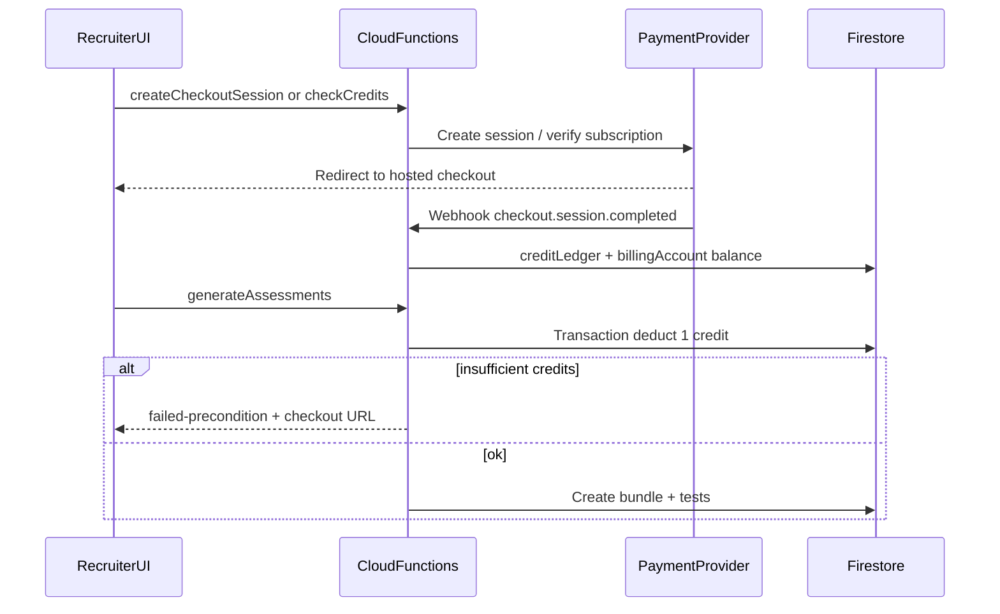

# Payment Integration Plan for PracticalSkills

**Status:** Future phase — implement after core assessment flows are validated in production-like testing.

---

## 1. Goals

Recruiters must pay (or have prepaid balance/credits) before generating an assessment bundle for a candidate. Payments should:

- Gate server-side test creation in [`functions/src/generateAssessments.ts`](../../functions/src/generateAssessments.ts) (not UI-only)
- Align with existing pricing intent in [PROJECT_OVERVIEW.md](./PROJECT_OVERVIEW.md): freemium + $99/10 assessments + $299/50 assessments
- Cover variable API cost (~$0.04–0.06 per completed assessment per [API_COST.md](./API_COST.md)
- Extend cleanly to Phase 4 company billing ([RECRUITER_WORKFLOW_1.md](./RECRUITER_WORKFLOW_1.md))

---

## 2. Current State (gaps)

| Area | Today | Gap |
|------|-------|-----|
| Auth | Google OAuth, `users/{uid}` profile ([`src/types/user.ts`](../types/user.ts)) | No billing fields |
| Billable anchor | `candidates.createdBy` = recruiter UID | No org/company billing yet |
| Test creation | `generateAssessments` → `assessmentBundles` + `tests/{token}` | No payment gate |
| Cost visibility | `usageEvents` via [`functions/src/usageLogging.ts`](../../functions/src/usageLogging.ts) | Tracks API cost, not revenue |
| Security | Open Firestore rules on candidates/tests/bundles | Payment must be server-enforced |
| Docs | `subscriptionPlan`, `stripeCustomerId` in [TECHNICAL_ARCHITECTURE.md](./TECHNICAL_ARCHITECTURE.md) | Not implemented |

**Natural integration choke point:** beginning of `generateAssessments` (and legacy `generateTestProfile`) after `assertCandidateAccess`, before `createTechnicalTest` / `createPersonalityTest`.



---

## 3. Define the billable unit (decision required before build)

The product sells **assessments**, but the code creates **bundles** containing one or more test types.

**Recommended default:** **1 assessment credit = 1 bundle generation** (regardless of whether the bundle includes technical, personality, or both). This matches "10 assessments/month" in product docs and keeps UX simple.

Document edge cases explicitly:

| Action | Bill? | Rationale |
|--------|-------|-----------|
| First `generateAssessments` for a candidate | Yes (1 credit) | Primary value delivery |
| `forceRegenerate` (new bundle) | Yes (1 credit) | Creates new tests + API cost |
| `extendTestInvite` (extend expiry only) | No | Same bundle, no new content |
| `extendTestInvite` with regenerate | Yes | Creates replacement test docs |
| `analyzeResume` re-run | No (or separate tier limit) | Already covered by subscription quota in docs |
| Resend invitation | No | Throttled by [`inviteThrottle.ts`](../../functions/src/inviteThrottle.ts) |

Alternative (more granular): charge per test type (technical = 1, personality = 0.5). Higher complexity; defer unless pricing demands it.

---

## 4. Billing model options

### Option A — Prepaid credit wallet (recommended primary)

Recruiter buys credit packs (e.g. 10 / 50 / 200 assessments). Credits stored server-side; deducted atomically when a bundle is created.

- **Pros:** Smooth UX after top-up; fewer Stripe fees vs charging per generation; matches "buy assessments" mental model
- **Cons:** Refund/chargeback handling; must prevent client-side balance tampering
- **Best for:** Pay-as-you-go recruiters, freemium → paid conversion

### Option B — Monthly subscription with included quota

Starter (10/mo), Professional (50/mo) per [PROJECT_OVERVIEW.md](./PROJECT_OVERVIEW.md). Quota resets each billing period; overage via credits or auto-charge.

- **Pros:** Predictable MRR; aligns with competitor positioning (HackerRank ~$165/mo)
- **Cons:** Proration, dunning, cancellation flows; quota sync via webhooks
- **Best for:** Core SaaS revenue model

### Option C — Pay-per-generation checkout

Stripe Checkout opens each time recruiter clicks "Generate assessments"; payment confirmed via webhook before bundle creation.

- **Pros:** No wallet logic; simplest accounting for low volume
- **Cons:** Friction on every hire; higher effective fees on small charges; poor UX for agencies
- **Best for:** Early beta with very low volume

### Option D — Hybrid (recommended end-state)

Combine **B + A**:

- Subscription includes monthly assessment quota
- Credit wallet for overage, one-off users, and enterprise top-ups
- Optional freemium: 1 free assessment/month (tracked in `billingAccounts.freeCreditsUsedThisMonth`)

This matches both the documented pricing tiers and the request for "payment or balance/account."

---

## 5. Payment provider comparison

| Provider | Model | Typical fee | Tax/VAT | Best fit for PracticalSkills |
|----------|-------|-------------|---------|------------------------------|
| **[Stripe](https://stripe.com)** | Payment processor (you are seller) | 2.9% + $0.30 | You handle ([Stripe Tax](https://stripe.com/tax) ~0.5% extra) | Full control, subscriptions + metered + wallet; already referenced in architecture docs |
| **[Paddle](https://paddle.com)** | Merchant of Record | 5% + $0.50 | Included globally | B2B invoicing, net terms, procurement-friendly; Phase 4 enterprise |
| **[Lemon Squeezy](https://lemonsqueezy.com)** | Merchant of Record (Stripe-owned) | 5% + $0.50 | Included | Fastest MoR setup for solo/small team; limited usage-based billing |
| **PayPal / Braintree** | Processor | ~2.9% + $0.30 | You handle | Only if customers demand it; add as secondary method later |

### Recommendation by stage

| Stage | Provider | Why |
|-------|----------|-----|
| **Future MVP billing** | **Stripe** | Best Firebase ecosystem (Checkout, Billing, Customer Portal, webhooks); supports subscription + one-time credit packs + metadata on sessions; lowest fees at scale; [TECHNICAL_ARCHITECTURE.md](./TECHNICAL_ARCHITECTURE.md) already assumes Stripe |
| **If global tax compliance is a blocker** | **Lemon Squeezy** first | Live in ~hours with MoR; migrate to Stripe when MRR justifies engineering (common pattern at ~$50k–100k MRR) |
| **Enterprise B2B (Phase 4+)** | **Paddle** or Stripe Invoicing | Formal invoices, PO workflows; Paddle if you want MoR for international enterprise |

**Not recommended now:** building a custom payment form (PCI scope), or client-side balance updates.

---

## 6. Proposed Firestore data model

Extend gradually; all balance mutations **server-only** via Cloud Functions + Firestore transactions.

### `billingAccounts/{accountId}`

Use `accountId = uid` initially; migrate to `companyId` in Phase 4.

```typescript
{
  ownerId: string              // users/{uid}
  stripeCustomerId: string | null
  subscriptionStatus: 'none' | 'active' | 'past_due' | 'canceled'
  subscriptionPlan: 'free' | 'starter' | 'professional' | 'enterprise'
  subscriptionPeriodEnd: Timestamp | null
  includedAssessmentsPerPeriod: number
  assessmentsUsedThisPeriod: number
  creditBalance: number        // prepaid credits (integer)
  freeAssessmentUsedAt: Timestamp | null  // freemium tracking
  createdAt, updatedAt
}
```

### `creditLedger/{entryId}` (append-only audit trail)

```typescript
{
  accountId: string
  type: 'topup' | 'subscription_grant' | 'deduction' | 'refund' | 'adjustment'
  amount: number               // + or -
  balanceAfter: number
  referenceType: 'bundle' | 'checkout_session' | 'subscription_invoice' | 'manual'
  referenceId: string
  createdBy: string            // uid or 'system'
  createdAt: Timestamp
  idempotencyKey: string       // prevent duplicate webhook credits
}
```

### Extend `assessmentBundles/{bundleId}`

```typescript
{
  // existing fields...
  billingAccountId: string
  billingStatus: 'paid' | 'refunded'
  creditLedgerEntryId: string
  priceCents?: number          // snapshot for reporting
}
```

### Extend `users/{uid}` (optional denormalization)

```typescript
{
  stripeCustomerId?: string
  billingAccountId?: string
}
```

---

## 7. Cloud Functions to add

| Function | Type | Purpose |
|----------|------|---------|
| `createCheckoutSession` | onCall | Credit pack or subscription checkout; metadata: `{ accountId, type, packSize }` |
| `createBillingPortalSession` | onCall | Stripe Customer Portal (manage card, cancel sub) |
| `stripeWebhook` | onRequest (HTTP) | Verify signature; handle `checkout.session.completed`, `invoice.paid`, `customer.subscription.*` |
| `getBillingSummary` | onCall | Balance, quota remaining, plan — for Settings UI |
| Modify `generateAssessments` | existing | Transaction: check quota/credits → deduct → create bundle (rollback on failure) |

**Webhook hardening:** raw body parsing, signature verification, idempotency keys stored in `creditLedger`, return 2xx only after Firestore commit.

**Secrets:** `STRIPE_SECRET_KEY`, `STRIPE_WEBHOOK_SECRET` via `defineSecret` (same pattern as `ANTHROPIC_API_KEY`).

---

## 8. Frontend changes (future)

| Location | Change |
|----------|--------|
| [`RecruiterSettingsPage.tsx`](../pages/recruiter/RecruiterSettingsPage.tsx) | Billing tab: plan, credits, usage this period, "Buy credits" / "Manage subscription" |
| [`AssessmentSetupPanel.tsx`](../components/recruiter/AssessmentSetupPanel.tsx) / [`CandidateDetailPage.tsx`](../pages/recruiter/CandidateDetailPage.tsx) | Show credits remaining; block generate with CTA to checkout when insufficient |
| [`src/services/functions.ts`](../services/functions.ts) | Wrappers for billing callables |
| New `src/types/billing.ts` | Shared types for billing summary |

**UX flow:** Recruiter selects test types → if balance OK, generate immediately → if not, modal with "Buy 10 assessments ($X)" → redirect to Stripe Checkout → return URL → auto-retry generate.

---

## 9. Prerequisites (do before payment code)

These are blockers or strong recommendations from current scaffold state:

1. **Firestore rules hardening (Phase 1b)** — Clients must not write `billingAccounts`, `creditLedger`, or bundle billing fields. [`firestore.rules`](../../firestore.rules) currently allows open writes on bundles/tests.
2. **Stable bundle generation flow** — Confirm multi-type bundles (technical + personality) are the permanent model; deprecate `generateTestProfile` or route it through the same billing gate.
3. **Usage logging baseline** — Already exists; extend to log `billingEvents` or link ledger entries for reconciliation.
4. **Auth stable in production** — Google OAuth working; dev bypass (`VITE_DISABLE_RECRUITER_AUTH`) disabled in prod.
5. **Pricing finalized** — Credit pack prices, subscription tiers, freemium limits (see [PROJECT_OVERVIEW.md](./PROJECT_OVERVIEW.md) pricing section).

---

## 10. Provider setup checklist (Stripe path)

### Account and product setup

1. Create [Stripe account](https://dashboard.stripe.com/register) (start in **Test mode**)
2. Create **Products** in Stripe Dashboard:
   - Subscription: Starter ($99/mo, 10 assessments), Professional ($299/mo, 50 assessments)
   - One-time: Credit packs (10 / 50 / 200 assessments) — price TBD (e.g. $49 / $199 / $699)
3. Enable **Customer Portal** (subscription management, payment method updates)
4. Configure **Stripe Tax** (if not using MoR) or consult accountant for US sales tax nexus

### Firebase / Cloud Functions

5. Add `stripe` npm package to [`functions/package.json`](../../functions/package.json)
6. Store secrets:
   ```bash
   firebase functions:secrets:set STRIPE_SECRET_KEY
   firebase functions:secrets:set STRIPE_WEBHOOK_SECRET
   ```
7. Deploy HTTP webhook function; register URL in Stripe Dashboard → Developers → Webhooks
8. For local dev: `stripe listen --forward-to localhost:5001/PROJECT/region/stripeWebhook`
9. Add webhook events: `checkout.session.completed`, `invoice.paid`, `invoice.payment_failed`, `customer.subscription.updated`, `customer.subscription.deleted`

### Frontend

10. Add publishable key to `.env.local`: `VITE_STRIPE_PUBLISHABLE_KEY` (safe for client)
11. Implement Checkout redirect or [Stripe Embedded Checkout](https://docs.stripe.com/checkout/embedded)
12. Define success/cancel return routes (e.g. `/recruiter/settings?billing=success`)

### Compliance and ops

13. Terms of Service + refund policy (especially for prepaid credits)
14. PCI: use Stripe Checkout/Elements only — never handle raw card numbers
15. Reconciliation: weekly export Stripe + `creditLedger` vs `assessmentBundles`
16. Monitoring: alert on webhook failures, negative balances, duplicate idempotency keys

---

## 11. Phased implementation roadmap

### Phase P0 — Design and prerequisites (1–2 weeks)

- Finalize billable unit and hybrid pricing model
- Complete Firestore rules hardening for billing collections
- Add `billingAccounts` schema (empty defaults on first recruiter login)
- Document refund policy

### Phase P1 — Stripe infrastructure (1–2 weeks)

- `createCheckoutSession`, `stripeWebhook`, `getBillingSummary`
- Credit top-up flow only (no subscription yet)
- Manual test: buy credits → webhook → balance increases

### Phase P2 — Generation gate (1 week)

- Wrap `generateAssessments` with credit deduction transaction
- Handle `failed-precondition` in UI with checkout CTA
- Attach billing metadata to `assessmentBundles`

### Phase P3 — Subscriptions (1–2 weeks)

- Stripe Billing for Starter/Professional tiers
- Monthly quota grant on `invoice.paid`
- Freemium: 1 free assessment/month for `free` plan
- Customer Portal link in Settings

### Phase P4 — Company billing (align with RECRUITER_WORKFLOW Phase 4)

- `billingAccounts` owned by `companies/{id}` not `users/{uid}`
- Shared credit pool for team; role `admin` manages billing
- Consider Paddle or Stripe Invoicing for enterprise net-30

### Phase P5 — Polish

- Admin dashboard for credits/refunds
- Dunning emails for failed subscription payments
- Tax reporting exports

**Estimated total engineering:** 4–8 weeks part-time after prerequisites, depending on subscription complexity.

---

## 12. Security requirements

- **Never** update `creditBalance` from the client; Firestore rules `allow write: if false` on `billingAccounts` and `creditLedger`
- Deduct credits in the **same Firestore transaction** as bundle creation (or deduct first with idempotency key tied to pending bundle ID)
- Webhook endpoint: verify `stripe-signature`; use Firebase `onRequest` with raw body
- Log all ledger mutations for dispute resolution
- Rate-limit `createCheckoutSession` per uid (prevent session spam)

---

## 13. Testing strategy

| Layer | Approach |
|-------|----------|
| Stripe | Test mode cards (`4242...`), CLI webhook forwarding |
| Functions | Emulator tests for deduct + insufficient balance + idempotent webhook replay |
| E2E | Recruiter with 0 credits → checkout → generate → bundle has `billingStatus: paid` |
| Edge cases | Double webhook delivery, generate failure after deduct (compensating credit), `forceRegenerate` |

---

## 14. Economics sanity check

| Metric | Value |
|--------|-------|
| Variable cost per assessment | ~$0.04–0.06 |
| Starter plan | $99 / 10 = **$9.90/assessment** revenue |
| Stripe fee on $99 sub | ~$3.18 |
| Gross margin per Starter assessment | ~$9.50 − $0.05 cost ≈ **99%** (before fixed ops) |

Prepaid credits and subscriptions are economically viable; per-generation $0.30 fixed Stripe fee matters only for very small one-off charges.

---

## 15. Open decisions (resolve before P1)

1. **Billable unit:** 1 bundle = 1 credit (recommended) vs per test type?
2. **Primary provider:** Stripe (recommended) vs Lemon Squeezy for MoR speed?
3. **Freemium:** 1 free assessment/month — enforce at billing layer or marketing-only?
4. **Refunds:** Credit restore on bundle cancel within 24h? Partial refunds on unused credits?
5. **Phase 4 timing:** User-level billing first, or wait for `companies` collection?

---

## 16. Relationship to existing docs

| Doc | Update when implementing |
|-----|--------------------------|
| [TECHNICAL_ARCHITECTURE.md](./TECHNICAL_ARCHITECTURE.md) | Replace planned fields with actual schema |
| [API_COST.md](./API_COST.md) | Link billing credits to usageEvents for margin analysis |
| [RECRUITER_WORKFLOW_1.md](./RECRUITER_WORKFLOW_1.md) | Mark Phase 4 billing tasks with PAYMENT.md reference |
| [PROJECT_OVERVIEW.md](./PROJECT_OVERVIEW.md) | Confirm pricing tiers match Stripe products |

---

## Summary recommendation

Start with **Stripe + hybrid billing (subscription quota + prepaid credits)**, bill **one credit per bundle generation**, gate **`generateAssessments` server-side**, and implement only after **Firestore rules hardening**. Use Lemon Squeezy instead if international tax compliance must be zero-touch before launch; plan a Stripe migration path when volume grows.
