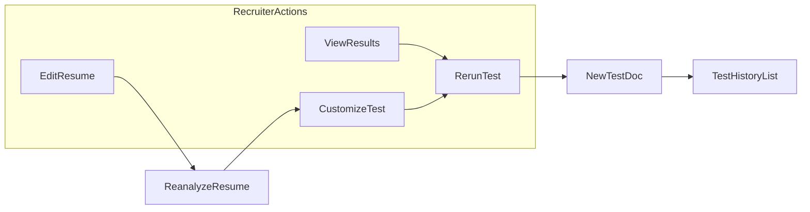
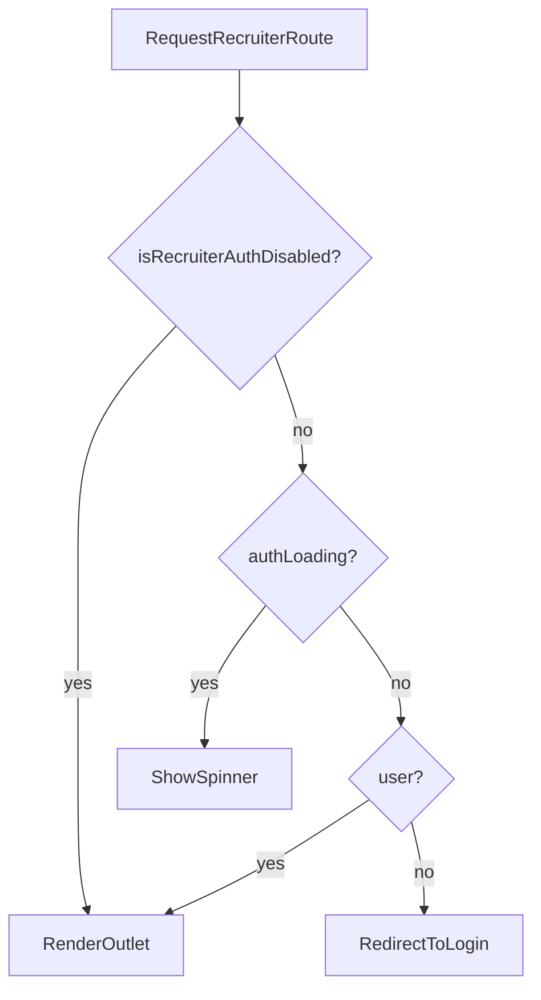
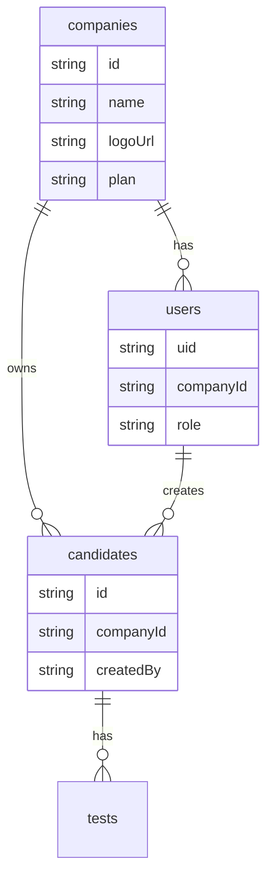

# Recruiter Dashboard Use Cases & Roadmap

**Document:** RECRUITER_WORKFLOW_1  
**Status:** Phases 1–3 complete · **Phase 4 pending**  
**Last updated:** June 2026

A use-case catalog for the recruiter portal, mapped to what exists today vs. what to build next — including Google Auth (with a dev bypass flag), scoped portfolios, test lifecycle workflows, profile editing, and a future multi-recruiter company model.

Related docs: [PROJECT_OVERVIEW.md](./PROJECT_OVERVIEW.md), [TECHNICAL_ARCHITECTURE.md](./TECHNICAL_ARCHITECTURE.md)

### Phase status

| Phase | Focus | Status |
|-------|--------|--------|
| **1** | Secure solo recruiter (auth, scoped portfolio, test history, profile) | **Done** |
| **2** | Actionable dashboard (filters, needs-attention, skills edit, test customization) | **Done** |
| **3** | Decision support (comparison, export, pipeline, expired invites, resume upload, stats) | **Done** |
| **4** | Company profile & multi-recruiter | **Pending** |

---

## Current baseline

The recruiter portal is an **authenticated solo-recruiter workflow** (Phases 1–3 shipped). Google sign-in (or dev bypass), scoped portfolio, actionable dashboard, candidate detail with test lifecycle, results review, and pipeline actions are in place. **Phase 4** (company model, team roles, org-wide portfolio) is not started.

### What works today

| Area | Status |
|------|--------|
| Google auth + protected routes + dev bypass | `ProtectedRoute`, `RecruiterLoginPage`, `VITE_DISABLE_RECRUITER_AUTH` |
| Scoped portfolio (`createdBy`) | `subscribeToCandidates(uid)` on dashboard |
| Recruiter profile + submission prefill | `RecruiterSettingsPage`, `NewSubmissionPanel` |
| New submission with recruiter + candidate fields | `NewSubmissionPanel` |
| Portfolio filters, stats, needs-attention queue | `PortfolioFiltersBar`, `PortfolioStatsBar`, `NeedsAttentionQueue` |
| Chronological recent list (scoped) | `RecentSubmissionsList` |
| Skills profile display + manual edit | `SkillsProfileCard`, `SkillsProfileEditor` |
| Test customization before generate | `TestCustomizationPanel` |
| Generate test + invite (copy, Resend, mailto) | `InviteLinkPanel` |
| Extend / regenerate expired invites | `ExpiredInvitePanel`, `extendTestInvite` |
| Re-run test + history tab | `CandidateDetailPage`, `TestHistoryPanel` |
| Results: comparison, export, mark reviewed, pipeline | `ResumeTestComparisonPanel`, `printAssessmentReport`, pipeline panel |
| In-app notifications on test complete | `NotificationBell`, `users/{uid}/notifications` |
| Resume file upload (.txt / .pdf / .docx) | `ResumeFileUpload`, `extractResumeText` |
| Edit candidate resume → re-analyze + retry on failure | `CandidateDetailPage`, `analysisError` |
| Candidate self-service results | `RecruitResultsPage` via email in `localStorage` |

### Remaining gaps (Phase 4 and polish)

- **Phase 4 pending** — no `companies` collection, team invites, org-scoped portfolio, or company branding
- Firestore / Storage rules still **open for local dev** (Phase 1b hardening not deployed)
- A3 first-time onboarding flow (settings banner only; no dedicated onboarding wizard)
- A4 email notification toggle on settings (H1)
- B7 duplicate candidate warning
- D7 test templates; E5 retest reason; F7 cohort comparison
- G3 full branded invite / candidate portal (company logo — Phase 4)
- H2–H4 compliance, GDPR export, billing

---

## Industry patterns to adopt

Common practices from assessment platforms (HackerRank, Codility, TestGorilla) and 2025 recruiting workflow guidance:

1. **Skills-first, role-relevant assessments** — test maps to resume claims and job requirements, not generic puzzles.
2. **Short, clear candidate commitment** — state duration and question count upfront; target 75%+ completion; shorten or improve invite copy if completion drops.
3. **Recruiter dashboard as action center** — surface "needs attention" (expired invites, new results, stale in-progress) rather than only a flat list.
4. **ATS remains source of truth (later)** — PracticalSkills is the assessment layer; status sync back to Greenhouse/Lever is a Phase 4 integration, not a replacement ATS.
5. **Pilot one role family first** — validate workflow with one stack (e.g. C#/.NET) before multi-stack expansion.
6. **Human override always available** — recruiters can edit skills, resend invites, and retest without being blocked by automation.
7. **Audit trail for decisions** — who sent the test, when results were viewed, retest reason (important once multiple recruiters share a company).

---

## Use-case catalog

### A. Authentication & recruiter identity

| ID | Use case | Actor | Trigger | Outcome | Priority |
|----|----------|-------|---------|---------|----------|
| A1 | Sign in with Google | Recruiter | Visits `/recruiter` unauthenticated | Firebase Auth session; redirect to dashboard | **Done** (Phase 1) |
| A2 | Sign out | Recruiter | Clicks sign out in header | Session cleared; redirect to login | Done (Phase 1) |
| A3 | First-time onboarding | New recruiter | First Google sign-in | Prompt for display name, default company, notification prefs; create `users/{uid}` doc | Partial — profile doc + settings banner (Phase 1) |
| A4 | Edit my profile | Recruiter | Settings page | Update name, default company, email notification toggle | Partial — name/company done (Phase 1); notification toggle pending (H1) |
| A5 | Protected routes | System | Any `/recruiter/*` request | Unauthenticated users see login, not global data | **Done** (Phase 1) |
| A6 | Dev auth bypass | Developer | `VITE_DISABLE_RECRUITER_AUTH=true` in `.env.local` | Recruiter routes accessible without Google sign-in for rapid local testing | **Done** (Phase 1) |

Google OAuth is the primary sign-in method. Email/password can be deferred. On sign-in, prefill `NewSubmissionPanel` from profile instead of manual entry.

---

### B. Dashboard & recruit portfolio

| ID | Use case | Actor | Trigger | Outcome | Priority |
|----|----------|-------|---------|---------|----------|
| B1 | View my recruit portfolio | Recruiter | Opens dashboard | List scoped to `createdBy == uid` (Phase 1) or `companyId` (Phase 4) | **Done** (Phase 1; org scope Phase 4) |
| B2 | Recent submissions | Recruiter | Dashboard default view | Same as B1, ordered by `createdAt desc` | Done (Phase 1) |
| B3 | Filter & search portfolio | Recruiter | Status tabs, search box | Filter by status, hiring company, date range, name/email search | Done (Phase 2; date range not yet) |
| B4 | Needs-attention queue | Recruiter | Dashboard widget | Cards for: new results unread, invite expiring in 48h, in-progress >3 days, analysis failed | **Done** (Phase 2) |
| B5 | Portfolio summary stats | Recruiter | Dashboard header | Counts: active invites, awaiting results, completed this week, avg score | **Done** (Phase 3) |
| B6 | Quick new submission | Recruiter | Sticky panel / `#new-submission` anchor | Create candidate without leaving dashboard | Done |
| B7 | Duplicate candidate warning | Recruiter | Submit with existing email in portfolio | Warn or link to existing record; optional merge | P2 — pending |

**Portfolio definition:** For solo recruiters (Phase 1–3), "portfolio" = candidates where `createdBy == auth.uid`. For agencies, optionally also filter by `hiringCompany`. For companies (Phase 4), entire org pool with "assigned to me" filter.

---

### C. Candidate intake & skills review

| ID | Use case | Actor | Trigger | Outcome | Priority |
|----|----------|-------|---------|---------|----------|
| C1 | Submit new candidate | Recruiter | New submission form | Create `candidates/{id}` + trigger `analyzeResume` | Done |
| C2 | Agency: different hiring company | Recruiter | Checkbox on form | Store `hiringCompany` distinct from `recruiterCompany` | Done |
| C3 | View skills overview | Recruiter | Candidate detail after analysis | `SkillsProfileCard` | Done |
| C4 | Edit candidate profile | Recruiter | Edit name/email/resume on detail page | `updateCandidateProfile` → re-analyze | Done |
| C5 | Edit skills profile manually | Recruiter | Skills card "Edit" mode | Add/remove/reorder skills before test gen; override AI | **Done** (Phase 2) |
| C6 | Upload resume file | Recruiter | File picker on intake | PDF/DOCX → Storage → extracted text (Cloud Function) | **Done** (Phase 3) |
| C7 | Retry failed analysis | Recruiter | Error state on detail page | Manual "Re-analyze" button | **Done** (Phase 2) |

---

### D. Test creation, invite & lifecycle

| ID | Use case | Actor | Trigger | Outcome | Priority |
|----|----------|-------|---------|---------|----------|
| D1 | Auto-generate test from skills | Recruiter | "Generate test" on detail page | `generateTestProfile` → `tests/{token}` + invite panel | Done |
| D2 | Customize test profile | Recruiter | Before generate | Reorder skills, adjust question counts, preview duration | Done (Phase 2; skill reorder via C5) |
| D3 | Send test invitation | Recruiter | Invite panel | Email via `sendInvitation` or copy link | Done |
| D4 | Resend invitation | Recruiter | Pending/expired invite | Resend email with same or new link | Done |
| D5 | Track invite status | Recruiter | Candidate detail + dashboard badge | Show pending / in-progress / completed / expired | **Done** (Phase 1–2) |
| D6 | Extend or regenerate expired invite | Recruiter | Expired test row | New token or extend `expiresAt` without full retest | **Done** (Phase 3) |
| D7 | Save test template | Recruiter | After customizing profile | Reusable template per role (e.g. "Senior .NET") | P3 — pending (Phase 4) |

---

### E. Retest workflows

| ID | Use case | Actor | Trigger | Outcome | Priority |
|----|----------|-------|---------|---------|----------|
| E1 | Re-run same assessment | Recruiter | After completed test | New `tests/{token}`; keep history; update `testId` to latest | Done |
| E2 | Re-run after resume change | Recruiter | Edit resume → re-analyze → re-run | New skills profile drives new question mix | Done (implicit) |
| E3 | View test attempt history | Recruiter | Candidate detail "History" tab | List all tests via `subscribeToTestsForCandidate`; compare scores | **Done** (Phase 1) |
| E4 | Retest with adjusted focus | Recruiter | Customize profile then re-run | e.g. drop obsolete skills, weight weak areas | Done (Phase 2 — skills edit + customization) |
| E5 | Record retest reason | Recruiter | Re-run dialog | Optional note stored on test doc for audit | P2 — pending |



---

### F. Results review & decisions

| ID | Use case | Actor | Trigger | Outcome | Priority |
|----|----------|-------|---------|---------|----------|
| F1 | View overall + category/skill breakdown | Recruiter | Test completed | Exists on detail page | Done |
| F2 | Per-question breakdown | Recruiter | Expand results section | Exists | Done |
| F3 | Resume vs test comparison | Recruiter | Results section | Flag mismatches: claimed skill level vs score | **Done** (Phase 3) |
| F4 | Mark result reviewed | Recruiter | "Mark reviewed" button | Clears dashboard "new results" badge; sets `reviewedAt` | **Done** (Phase 2) |
| F5 | Export PDF report | Recruiter | Export button | Shareable report for hiring manager | Done (Phase 3 — print-to-PDF) |
| F6 | Pipeline action | Recruiter | Advance / hold / archive | Update `pipelineStatus`; optional note | **Done** (Phase 3) |
| F7 | Compare candidates (cohort) | Recruiter | Same role/hiring company | Side-by-side scores for 2+ recruits | P3 — pending (Phase 4) |
| F8 | Notify recruiter on completion | System | `scoreTest` completes | Email to `recruiterEmail` + in-app notification | **Done** (Phase 1–2) |

---

### G. Candidate-facing workflows (recruiter-adjacent)

| ID | Use case | Notes |
|----|----------|-------|
| G1 | Candidate views all their invites/results by email | Exists on `RecruitResultsPage` |
| G2 | Candidate continues in-progress test | Exists |
| G3 | Branded invite email with hiring company name | Partially via `sendInvitation`; full company logo/branding **pending Phase 4** |

---

### H. Settings, compliance & admin (later)

| ID | Use case | Phase |
|----|----------|-------|
| H1 | Notification preferences | P1 |
| H2 | Data retention / delete candidate | P2 |
| H3 | Export all data (GDPR) | P3 |
| H4 | Billing & plan limits | Phase 4 (company) |

---

## Phase 1 authentication — implementation steps

> **Status: Done** (June 2026). Steps below are retained as reference for setup and Phase 1b hardening.

Phase 1 replaced anonymous global access with Google Auth and scoped recruiter workflows. A **dev bypass flag** keeps the current rapid-testing experience available locally without signing in.

### Step 1 — Firebase Console setup

1. In Firebase Console → Authentication → Sign-in method, enable **Google**.
2. Add authorized domains: `localhost`, your production domain, and Firebase Hosting preview domains.
3. Copy web client config into `.env.local` (same `VITE_FIREBASE_*` vars already used by `src/lib/firebase.ts`).

### Step 2 — Environment flag for auth bypass

Add to `.env.local` (create from project root env template when added):

```bash
# Set to "true" to skip Google sign-in on recruiter routes during local dev.
# Only honored when import.meta.env.DEV is true (Vite dev server).
VITE_DISABLE_RECRUITER_AUTH=true
```

Add to `.env.example` (document only; default unset/false):

```bash
VITE_DISABLE_RECRUITER_AUTH=
```

**Central helper** — `src/lib/recruiterAuth.ts`:

```typescript
export const isRecruiterAuthDisabled =
  import.meta.env.DEV && import.meta.env.VITE_DISABLE_RECRUITER_AUTH === 'true'
```

**Safety rules:**

- Bypass is allowed **only** when `import.meta.env.DEV === true`. Production builds ignore the flag even if set.
- When bypass is active, show a persistent banner in `AppLayout`: *"Auth disabled — development mode only"*.
- When auth is enabled (default), recruiter routes require a real Firebase session.
- Firestore rules remain open during early dev; tightening rules is a separate step that can lag behind UI auth. Document that bypass mode does not simulate secured rules.

### Step 3 — Auth service

Create `src/services/auth.ts`:

| Function | Purpose |
|----------|---------|
| `signInWithGoogle()` | `signInWithPopup(auth, googleProvider)` |
| `signOutRecruiter()` | `signOut(auth)` |
| `subscribeToAuthState(callback)` | Wraps `onAuthStateChanged` |
| `ensureUserProfile(user)` | Creates/updates `users/{uid}` on first sign-in |

Create `src/hooks/useAuth.ts`:

- Returns `{ user, profile, loading, isAuthenticated }`.
- When `isRecruiterAuthDisabled`, return a fixed **dev persona** without calling Firebase:

```typescript
const DEV_RECRUITER = {
  uid: 'dev-recruiter',
  email: 'dev@localhost',
  displayName: 'Dev Recruiter',
}
```

- Dev persona uses the same code paths as a real user for UI prefill; `createdBy` writes use `dev-recruiter` so test data is identifiable.

### Step 4 — Protected routes

Create `src/components/auth/ProtectedRoute.tsx`:



Wrap recruiter routes in `App.tsx`:

- `/recruiter/login` — public; Google sign-in button (hidden or skipped when bypass active)
- `/recruiter`, `/recruiter/candidates/:id`, `/recruiter/settings` — behind `ProtectedRoute`

When bypass is on, visiting `/recruiter/login` redirects to `/recruiter`.

### Step 5 — Login page & header

- **`src/pages/recruiter/RecruiterLoginPage.tsx`** — Google sign-in button, product name, link to What We Do.
- **`AppLayout.tsx`** — when authenticated (or bypass): show avatar/name, Settings link, Sign out (no-op or clears dev state when bypassed). When bypass active: amber dev banner above header.

### Step 6 — Scope data to recruiter

- Add `createdBy: string` to `Candidate` type and `createCandidate` writes (use `auth.uid` or `dev-recruiter`).
- Change `subscribeToCandidates` to accept `createdBy` and query `where('createdBy', '==', uid)`.
- Dashboard passes current uid from `useAuth`.
- Legacy candidates without `createdBy` are hidden when auth is on; optionally show all when bypass is on (configurable) to ease migration testing.

### Step 7 — Recruiter profile & form prefill

- `users/{uid}`: `email`, `displayName`, `photoURL`, `defaultCompany`, `createdAt`.
- **`src/pages/recruiter/RecruiterSettingsPage.tsx`** — edit display name and default company.
- Prefill `NewSubmissionPanel` recruiter fields from auth profile / `users/{uid}`.

### Step 8 — Firestore rules (incremental)

Phase 1a (UI auth only): keep open rules for emulator/local rapid testing.

Phase 1b (hardening):

```javascript
match /candidates/{id} {
  allow read, write: if isRecruiterAuthDisabledInEmulator()
    || (request.auth != null && resource.data.createdBy == request.auth.uid);
}
```

Use emulator-specific config or a separate `firestore.rules.dev` — do not deploy open rules to production.

### Step 9 — Cloud Functions auth checks

- Callable functions (`analyzeResume`, `generateTestProfile`, `sendInvitation`) should verify `request.auth` when not in emulator bypass mode.
- Return `unauthenticated` if missing; allow emulator/admin testing via Firebase emulator auth or documented test tokens.

### Auth quick-reference

| Mode | Env | Recruiter routes | `createdBy` | Firestore rules |
|------|-----|------------------|-------------|-----------------|
| **Production** | `VITE_DISABLE_RECRUITER_AUTH` unset | Google required | Real `uid` | Scoped (Phase 1b) |
| **Local dev (auth on)** | flag unset/false | Google required | Real `uid` | Open or emulator |
| **Local dev (bypass)** | `VITE_DISABLE_RECRUITER_AUTH=true` | No sign-in | `dev-recruiter` | Open; banner shown |

To toggle during a session: change `.env.local`, restart `npm run dev`.

---

## Recommended implementation phases

### Phase 1 — Secure solo recruiter — **Done**

**Goal:** Replace anonymous global access with authenticated, scoped workflows (with dev bypass for rapid testing).

**Deliverables** (all shipped)

- Google sign-in + `ProtectedRoute` + `VITE_DISABLE_RECRUITER_AUTH` bypass (dev only)
- Header: avatar, sign out, dev banner when bypassed
- `subscribeToCandidates(createdBy)` instead of global query
- Sync `candidate.status` to `completed` when test completes
- Test history tab on candidate detail (reuse `subscribeToTestsForCandidate`)
- Route `scoreTest` notification to `candidate.recruiterEmail`
- Recruiter profile settings page (name + default company)

**Follow-up (not blocking):** Phase 1b Firestore rule hardening for production (see Step 8 above).

---

### Phase 2 — Actionable dashboard — **Done**

- B3 filters (status, search, hiring company)
- B4 needs-attention queue
- F4 mark reviewed + F8 in-app notifications
- C5 manual skills edit before test gen
- D2 basic test customization (question counts per category)
- C7 retry analysis button

---

### Phase 3 — Decision support — **Done**

- F3 resume vs test comparison
- F5 PDF export (print-to-PDF report)
- F6 pipeline status (advance / hold / archive)
- D6 extend/regenerate expired invites
- C6 resume file upload
- B5 portfolio stats

---

### Phase 4 — Company profile & multi-recruiter — **Pending**

> **This is the next major build.** Phases 1–3 cover the solo-recruiter loop; Phase 4 adds organizations, shared portfolios, roles, and branding.

**Goal:** Organizations with multiple recruiters share a candidate pool, branding, and permissions.



**Company onboarding flow**

1. First Google sign-in → "Create company" or "Join with invite code"
2. Company admin sets name, logo, default hiring branding
3. Admin invites teammates (email link → join `companyId`)
4. Roles:
   - **admin** — billing, invite users, see all candidates, company settings
   - **recruiter** — create candidates, send tests, view org candidates
   - **viewer** — read-only results (hiring managers)

**Firestore collections**

- `companies/{companyId}`: `name`, `logoUrl`, `settings`, `createdAt`
- `users/{uid}`: add `companyId`, `role`
- `invites/{token}`: `companyId`, `email`, `role`, `expiresAt`
- `candidates/{id}`: add `companyId`; queries use `where('companyId', '==', ...)`

**Product features unlocked**

- Shared recruit portfolio across team
- Assign candidate to recruiter (`assignedTo`)
- Company-branded invite emails and candidate portal
- Per-company test templates (D7)
- Cohort comparison within company (F7)
- Billing per company
- Audit log: `activity/{id}` with `actorUid`, `action`, `candidateId`

**Agency variant:** Keep `hiringCompany` on candidates; add `clients/{clientId}` under company for agencies placing candidates at client firms (Phase 4b).

---

## Workflow coverage checklist

| Workflow | Covered by | Phase | Status |
|----------|------------|-------|--------|
| Google auth | A1, A5 | 1 | Done |
| Dev auth bypass | A6 | 1 | Done |
| Portfolio of recruits | B1, B2 | 1 (scope) + 4 (org-wide) | Done (solo); org-wide **pending** |
| Recent submissions | B2 | 1 | Done |
| Sending a test | D1, D3 | — | Done |
| Retest + history | E1–E4, E3 | 1–2 | Done |
| Profile edits (recruiter) | A3, A4 | 1 | Partial (no notification prefs) |
| Profile edits (skills) | C5 | 2 | Done |
| Dashboard actions | B3, B4, B5, F4, F8 | 2–3 | Done |
| Decision support | F3, F5, F6, D6, C6 | 3 | Done |
| Company + multi-recruiter | Phase 4 | 4 | **Pending** |

---

## Suggested route map

| Route | Purpose |
|-------|---------|
| `/recruiter/login` | Google sign-in (skipped when bypass active) |
| `/recruiter` | Dashboard (portfolio + new submission) |
| `/recruiter/candidates/:id` | Full candidate workflow |
| `/recruiter/settings` | Recruiter profile |
| `/recruiter/settings/company` | Company profile (**Phase 4 — pending**) |
| `/recruiter/team` | Invite/manage recruiters (**Phase 4 — pending**) |
| `/recruit/tests` | Candidate self-service (keep public) |

---

## What to build next

Phases 1–3 are complete. Recommended order for remaining work:

1. **Phase 4 — Company model** — `companies`, roles, team invites, org-scoped portfolio, branding, billing (see below)
2. **Phase 1b** — Production Firestore / Storage rule hardening
3. **Polish** — B7 duplicate warning, E5 retest reason, H1 notification prefs, date-range filter (B3)

---

## Implementation todos

| ID | Task | Phase | Status |
|----|------|-------|--------|
| phase1-auth | Google Auth, ProtectedRoute, `users/{uid}`, `candidates.createdBy`, scoped Firestore rules, `VITE_DISABLE_RECRUITER_AUTH` bypass | 1 | **Done** |
| phase1-history | Test attempt history on CandidateDetailPage; sync `candidate.status` on test completion | 1 | **Done** |
| phase1-profile | Recruiter settings page; prefill NewSubmissionPanel from auth profile | 1 | **Done** |
| phase2-dashboard | Filters, needs-attention queue, mark-reviewed, skills edit, test customization | 2 | **Done** |
| phase3-analytics | Resume vs test comparison, PDF export, pipeline actions, resume upload | 3 | **Done** |
| phase4-company | `companies` collection, roles, team invites, org-scoped portfolio, branding, billing | 4 | **Pending** |
